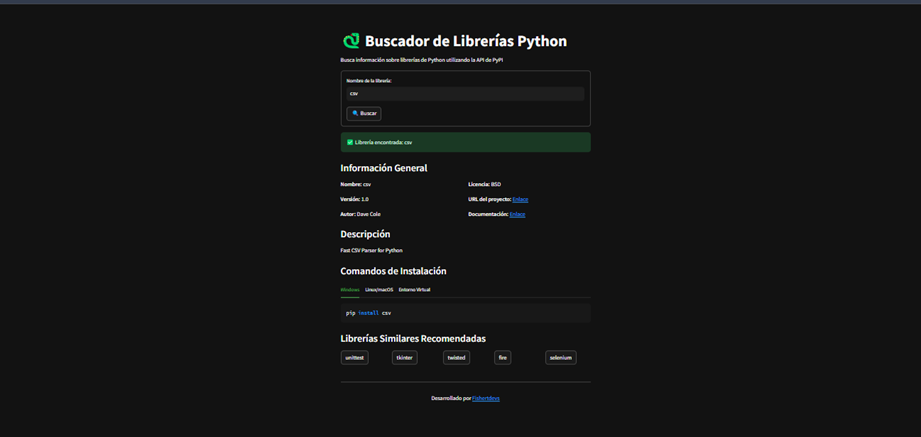

# Buscador de Librerías Python

Una aplicación interactiva para buscar información sobre librerías de Python utilizando la API de PyPI. Descubre detalles como la versión, descripción, autor, licencia y más, además de recomendaciones de librerías similares.

## Descripción

El **Buscador de Librerías Python** es una herramienta que permite a los desarrolladores consultar información detallada sobre cualquier librería disponible en PyPI. También ofrece recomendaciones de librerías similares basadas en palabras clave o categorías.

## Características

- Búsqueda de información detallada sobre librerías de Python desde PyPI.
- Visualización de datos como nombre, versión, autor, licencia, descripción y más.
- Recomendaciones de librerías similares basadas en palabras clave o categorías.
- Comandos de instalación listos para copiar y usar.
- Interfaz interactiva y fácil de usar con Streamlit.

## Tecnologías Utilizadas

- **Python**: Lenguaje principal para la lógica de la aplicación.
- **Streamlit**: Framework para crear aplicaciones web interactivas.
- **Requests**: Para realizar solicitudes HTTP a la API de PyPI.
- **Concurrent Futures**: Para manejar búsquedas simultáneas de librerías.

## Requisitos

Antes de comenzar, asegúrate de tener instalado lo siguiente:

- Python 3.8 o superior
- pip (gestor de paquetes de Python)

## Instalación

Sigue estos pasos para instalar y ejecutar la aplicación:

1. Clona este repositorio en tu máquina local:
git clone https://github.com/Fishertdevs/Buscador_de_Librerias.git
pip install -r requirements.txt
cd BuscadorLibreriasPython
## Preview

---
- Desarrollado por Harry Fishert.
   
